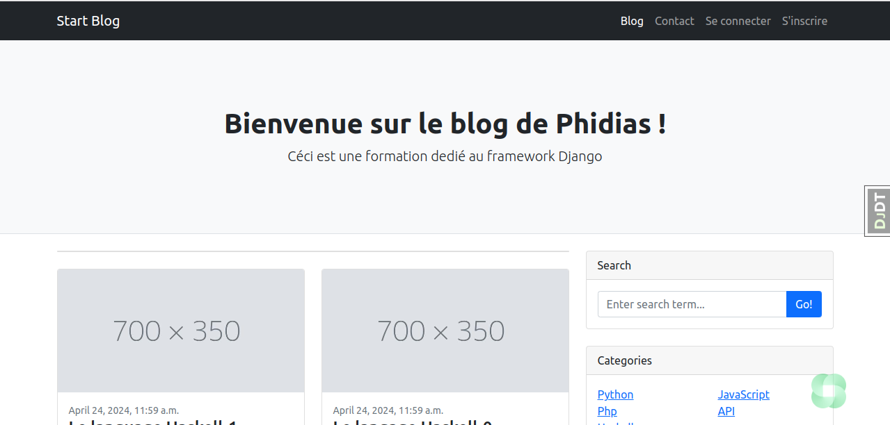
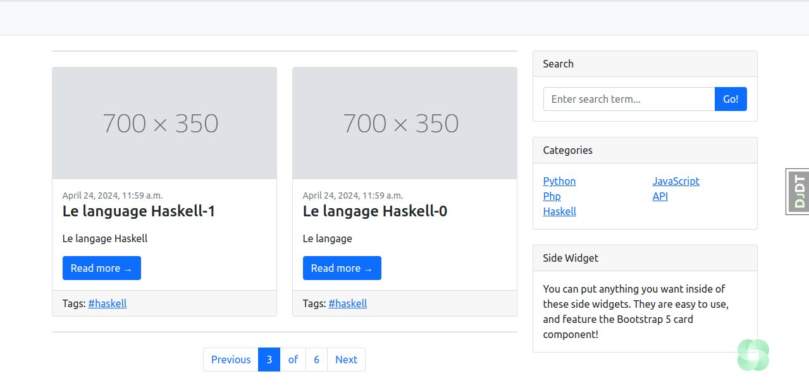

# BLOG
A complete Django application that manages user authentication, profile management and blog functionality. It includes templates for users, profiles, posts, comments and categories. Views manage user registration, login, logout, profile editing and post actions.





## Installation

**1. Clone the Repository:**

```bash
git clone https://github.com/Lyrecoph/blog.git
```

**2. Create a Virtual Environment:**

```bash
python -m venv venv
```

**3. Activate the Virtual Environment:**

- On Windows:

```bash
venv\Scripts\activate
```

- On Linux/macOS:

```bash
source venv/bin/activate
```

**4. Install Dependencies:**

```bash
pip install -r requirements.txt
```

**5. Configure the Database:**

Follow the specific instructions for configuring your database. This may involve creating a new database, setting up connection parameters, and applying migrations.

## Usage

**1. Run the Development Server:**

```bash
python manage.py runserver
```

**2. Create a Superuser:**

```bash
python manage.py createsuperuser
```

Follow the prompts to set up the superuser account.

```
settings.example.py

# settings.example.py

import os
from pathlib import Path

# Base directory of the project
BASE_DIR = Path(__file__).resolve().parent.parent

# Placeholder for the Django secret key
SECRET_KEY = 'your-secret-key-here'

# Set to False in production
DEBUG = True

# Add your allowed hosts
ALLOWED_HOSTS = ['localhost', '127.0.0.1']

# Database configuration (replace placeholders with actual values)
DATABASES = {
    'default': {
        'ENGINE': 'django.db.backends.postgresql',  # Or another database engine
        'NAME': 'your-database-name',
        'USER': 'your-database-user',
        'PASSWORD': 'your-database-password',
        'HOST': 'localhost',  # Or your database host
        'PORT': '5432',  # Or your database port
    }
}

# Application definition
INSTALLED_APPS = [
    'django.contrib.admin',
    'django.contrib.auth',
    'django.contrib.contenttypes',
    'django.contrib.sessions',
    'django.contrib.messages',
    'django.contrib.staticfiles',
    # Add your apps here
]

MIDDLEWARE = [
    'django.middleware.security.SecurityMiddleware',
    'django.contrib.sessions.middleware.SessionMiddleware',
    'django.middleware.common.CommonMiddleware',
    'django.middleware.csrf.CsrfViewMiddleware',
    'django.contrib.auth.middleware.AuthenticationMiddleware',
    'django.contrib.messages.middleware.MessageMiddleware',
    'django.middleware.clickjacking.XFrameOptionsMiddleware',
]

ROOT_URLCONF = 'your_project_name.urls'

TEMPLATES = [
    {
        'BACKEND': 'django.template.backends.django.DjangoTemplates',
        'DIRS': [BASE_DIR / 'templates'],
        'APP_DIRS': True,
        'OPTIONS': {
            'context_processors': [
                'django.template.context_processors.debug',
                'django.template.context_processors.request',
                'django.contrib.auth.context_processors.auth',
                'django.contrib.messages.context_processors.messages',
            ],
        },
    },
]

WSGI_APPLICATION = 'your_project_name.wsgi.application'

# Internationalization
LANGUAGE_CODE = 'en-us'
TIME_ZONE = 'UTC'
USE_I18N = True
USE_L10N = True
USE_TZ = True

# Static files (CSS, JavaScript, Images)
STATIC_URL = '/static/'
STATICFILES_DIRS = [BASE_DIR / "static"]

# Media files (user-uploaded content)
MEDIA_URL = '/media/'
MEDIA_ROOT = BASE_DIR / "media"

# Example email configuration (replace with actual values)
EMAIL_BACKEND = 'django.core.mail.backends.smtp.EmailBackend'
EMAIL_HOST = 'smtp.your-email-provider.com'
EMAIL_PORT = 587
EMAIL_USE_TLS = True
EMAIL_HOST_USER = 'your-email@example.com'
EMAIL_HOST_PASSWORD = 'your-email-password'

# Placeholder for other configurations, like caching, third-party APIs, etc.
```

## Features

**User Authentication:** Registration, login, and logout functionalities.

**Profile Management:** Update personal information.

**Blog:** Create, edit, and delete articles.

**Comments:** Users can comment on articles.

**Categories:** Organize articles by categories.

**Tags:** Articles can be tagged with keywords.

**Real-time Notifications:** Users receive notifications for new comments.

**Email Sharing:** Users can share articles via email (currently being finalized).

## Technologies Used

**Django:** Python web framework

**Python:** Programming language

**PostgreSQL (or other database):** Database management

**HTML, CSS, JavaScript:** Frontend technologies

**Bootstrap:** CSS framework

**CKEditor:** Rich text editor

**taggit:** Tag management

**channels (if used for SSE):** Real-time communication


## License
This project is licensed under the MIT License - see the LICENSE file for details.